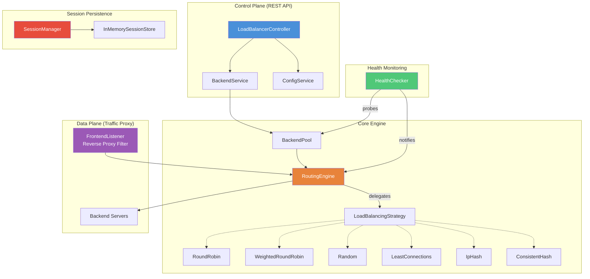

# Production-Grade Load Balancer — Implementation Plan

## Goal

Build a production-grade, configurable **Load Balancer** in Java / Spring Boot that demonstrates deep understanding of networking, high availability, and system scalability. The system allows runtime algorithm selection via a simple property change or API call.

---

## Architecture Overview



---

## Design Patterns & Principles

| Pattern | Where | Why |
|---------|-------|-----|
| **Strategy** | `LoadBalancingStrategy` + 6 implementations | Swap algorithms at runtime without touching routing logic |
| **Factory** | `StrategyFactory` | Centralised creation of strategy instances from enum/string |
| **Observer / Event** | `HealthChecker` → Spring Events → `RoutingEngine` | Decouple health monitoring from routing decisions |
| **State Machine** | `BackendStatus` enum transitions | `UNKNOWN → HEALTHY / UNHEALTHY` with threshold tracking |
| **Template Method** | `AbstractHealthChecker` | Shared scheduling loop; subclasses define probe logic |
| **Singleton (Spring)** | Services, Pools, Engine | Managed by Spring IoC container |
| **Builder / Record** | DTOs, Config | Immutable data transfer using Java Records |

**SOLID compliance:**
- **S** — Each class has a single responsibility (e.g., `HealthChecker` only checks, `RoutingEngine` only routes).
- **O** — New algorithms are added by implementing `LoadBalancingStrategy`; no existing code changes.
- **L** — All strategies are interchangeable behind the same interface.
- **I** — Thin interfaces (`LoadBalancingStrategy`, `SessionStore`, `HealthCheckProbe`).
- **D** — Services depend on abstractions (`LoadBalancingStrategy`), not concrete classes.

---

## Proposed Changes — File-by-File

### Package Layout

```
com.loadbalancer
├── LoadbalancerApplication.java          (existing — add scheduling)
├── model/
│   ├── Backend.java                      [NEW] Domain entity
│   ├── BackendStatus.java                [NEW] Enum (UNKNOWN, HEALTHY, UNHEALTHY, DRAINING)
│   ├── BackendPool.java                  [NEW] Thread-safe pool
│   └── Algorithm.java                    [NEW] Enum of supported algorithms
├── dto/
│   ├── RegisterBackendRequest.java       [NEW] Record
│   ├── BackendResponse.java              [NEW] Record
│   ├── HealthStatusResponse.java         [NEW] Record
│   ├── ConfigureAlgorithmRequest.java    [NEW] Record
│   ├── ConfigureAlgorithmResponse.java   [NEW] Record
│   └── ForwardResponse.java             [NEW] Record
├── strategy/
│   ├── LoadBalancingStrategy.java        [NEW] Interface
│   ├── RoundRobinStrategy.java           [NEW]
│   ├── WeightedRoundRobinStrategy.java   [NEW]
│   ├── RandomStrategy.java               [NEW]
│   ├── LeastConnectionsStrategy.java     [NEW]
│   ├── IpHashStrategy.java               [NEW]
│   ├── ConsistentHashStrategy.java       [NEW]
│   └── StrategyFactory.java              [NEW] Factory
├── health/
│   ├── HealthChecker.java                [NEW] Scheduled health monitor
│   ├── HealthCheckProbe.java             [NEW] Interface
│   ├── HttpHealthCheckProbe.java         [NEW] HTTP GET /health
│   └── TcpHealthCheckProbe.java          [NEW] TCP connect probe
├── session/
│   ├── SessionManager.java               [NEW] Cookie-based stickiness
│   └── SessionStore.java                 [NEW] Interface + in-memory impl
├── engine/
│   ├── RoutingEngine.java                [NEW] Core routing logic
│   └── ConnectionTracker.java            [NEW] Thread-safe active conn tracking
├── proxy/
│   └── ReverseProxyFilter.java           [NEW] Data-plane HTTP forwarding filter
├── event/
│   ├── BackendHealthEvent.java           [NEW] Spring ApplicationEvent
│   └── BackendHealthEventListener.java   [NEW] Listener updating pool
├── config/
│   └── LoadBalancerConfig.java           [NEW] @Configuration bean wiring
├── controller/
│   └── LoadBalancerController.java       [NEW] REST API (Control Plane)
└── exception/
    ├── BackendNotFoundException.java     [NEW]
    ├── BackendAlreadyExistsException.java[NEW]
    ├── NoHealthyBackendException.java    [NEW]
    └── GlobalExceptionHandler.java       [NEW] @RestControllerAdvice
```

---

### 1 · Model Layer

#### [NEW] [Backend.java](file:///Users/tapeshchavle/Downloads/loadbalancer/src/main/java/com/loadbalancer/model/Backend.java)

Thread-safe domain entity representing a backend server:
- Fields: `id` (UUID), `address`, `port`, `weight`, `status` (volatile AtomicReference), `activeConnections` (AtomicInteger), `totalRequests` (AtomicLong), `totalFailures` (AtomicLong), `consecutiveSuccesses`, `consecutiveFailures`, `healthCheckPath`, `createdAt`, `updatedAt`.
- Methods: `incrementConnections()`, `decrementConnections()`, `markHealthy()`, `markUnhealthy()`, `isAvailable()`.

#### [NEW] [BackendStatus.java](file:///Users/tapeshchavle/Downloads/loadbalancer/src/main/java/com/loadbalancer/model/BackendStatus.java)

Enum: `UNKNOWN`, `HEALTHY`, `UNHEALTHY`, `DRAINING`.

#### [NEW] [BackendPool.java](file:///Users/tapeshchavle/Downloads/loadbalancer/src/main/java/com/loadbalancer/model/BackendPool.java)

ConcurrentHashMap-backed pool. Methods: `register()`, `remove()`, `getHealthyBackends()`, `getAll()`, `getById()`. Fires `BackendHealthEvent` on status changes.

#### [NEW] [Algorithm.java](file:///Users/tapeshchavle/Downloads/loadbalancer/src/main/java/com/loadbalancer/model/Algorithm.java)

Enum: `ROUND_ROBIN`, `WEIGHTED_ROUND_ROBIN`, `RANDOM`, `LEAST_CONNECTIONS`, `IP_HASH`, `CONSISTENT_HASH`.

---

### 2 · DTO Layer (Java Records)

#### [NEW] RegisterBackendRequest, BackendResponse, HealthStatusResponse, ConfigureAlgorithmRequest, ConfigureAlgorithmResponse, ForwardResponse

All immutable Java Records. Validation annotations (`@NotBlank`, `@Min`, etc.) on request records.

---

### 3 · Strategy Layer (Load Balancing Algorithms)

#### [NEW] [LoadBalancingStrategy.java](file:///Users/tapeshchavle/Downloads/loadbalancer/src/main/java/com/loadbalancer/strategy/LoadBalancingStrategy.java)

```java
public interface LoadBalancingStrategy {
    Backend selectBackend(List<Backend> healthyBackends, String clientIp);
}
```

#### [NEW] Implementations

| Strategy | Logic |
|----------|-------|
| **RoundRobinStrategy** | Atomic counter `% size` |
| **WeightedRoundRobinStrategy** | Smooth weighted round-robin (NGINX-style: `currentWeight += effectiveWeight`, pick max, `currentWeight -= totalWeight`) |
| **RandomStrategy** | `ThreadLocalRandom.current().nextInt(size)` |
| **LeastConnectionsStrategy** | `min(backend.activeConnections)` with tie-breaking by weight |
| **IpHashStrategy** | `MurmurHash3(clientIp) % size` — deterministic, stable |
| **ConsistentHashStrategy** | Virtual-node hash ring (150 vnodes/backend), `TreeMap<Integer, Backend>`, `ceilingEntry(hash)` |

#### [NEW] [StrategyFactory.java](file:///Users/tapeshchavle/Downloads/loadbalancer/src/main/java/com/loadbalancer/strategy/StrategyFactory.java)

```java
public class StrategyFactory {
    public LoadBalancingStrategy create(Algorithm algorithm) { ... }
}
```
Maps `Algorithm` enum → concrete strategy. Returns singleton instances.

---

### 4 · Health Monitoring

#### [NEW] [HealthCheckProbe.java](file:///Users/tapeshchavle/Downloads/loadbalancer/src/main/java/com/loadbalancer/health/HealthCheckProbe.java)

```java
public interface HealthCheckProbe {
    boolean check(Backend backend);
}
```

#### [NEW] [HttpHealthCheckProbe.java](file:///Users/tapeshchavle/Downloads/loadbalancer/src/main/java/com/loadbalancer/health/HttpHealthCheckProbe.java)

Uses `RestClient` (Spring 4) to `GET http://{address}:{port}{healthCheckPath}`. Returns `true` on 2xx, `false` on timeout/error.

#### [NEW] [TcpHealthCheckProbe.java](file:///Users/tapeshchavle/Downloads/loadbalancer/src/main/java/com/loadbalancer/health/TcpHealthCheckProbe.java)

Opens a `Socket` with a 2-second timeout. Returns `true` if connection succeeds.

#### [NEW] [HealthChecker.java](file:///Users/tapeshchavle/Downloads/loadbalancer/src/main/java/com/loadbalancer/health/HealthChecker.java)

`@Scheduled(fixedRateString = "${lb.health.interval:5000}")` method iterates all backends, runs probe, tracks consecutive success/failure counts, publishes `BackendHealthEvent` when status transitions.

**State machine thresholds:**
- Mark unhealthy after `lb.health.unhealthy-threshold` (default 3) consecutive failures.
- Mark healthy after `lb.health.healthy-threshold` (default 2) consecutive successes.

---

### 5 · Session Persistence

#### [NEW] [SessionStore.java](file:///Users/tapeshchavle/Downloads/loadbalancer/src/main/java/com/loadbalancer/session/SessionStore.java)

```java
public interface SessionStore {
    Optional<String> getBackendId(String clientIdentifier);
    void store(String clientIdentifier, String backendId, Duration ttl);
    void remove(String clientIdentifier);
}
```

In-memory `ConcurrentHashMap` + scheduled eviction of expired entries. Can be swapped to Redis in production.

#### [NEW] [SessionManager.java](file:///Users/tapeshchavle/Downloads/loadbalancer/src/main/java/com/loadbalancer/session/SessionManager.java)

Reads/writes sticky session cookie. If sticky sessions enabled and cookie present, routes to that backend (if healthy). Otherwise, delegates to the algorithm.

---

### 6 · Routing Engine

#### [NEW] [RoutingEngine.java](file:///Users/tapeshchavle/Downloads/loadbalancer/src/main/java/com/loadbalancer/engine/RoutingEngine.java)

Orchestrates the routing decision:
1. Check sticky session → if hit and backend healthy → return backend.
2. Get healthy backends from pool.
3. Delegate to `LoadBalancingStrategy.selectBackend()`.
4. Optionally store sticky session mapping.
5. Increment `activeConnections` on selected backend.

Supports runtime algorithm switching via `setAlgorithm(Algorithm)`.

#### [NEW] [ConnectionTracker.java](file:///Users/tapeshchavle/Downloads/loadbalancer/src/main/java/com/loadbalancer/engine/ConnectionTracker.java)

Utility to atomically increment/decrement per-backend connection counts. Used by `LeastConnectionsStrategy`.

---

### 7 · Data Plane (Reverse Proxy)

#### [NEW] [ReverseProxyFilter.java](file:///Users/tapeshchavle/Downloads/loadbalancer/src/main/java/com/loadbalancer/proxy/ReverseProxyFilter.java)

A Spring `OncePerRequestFilter` (or `jakarta.servlet.Filter`) that:
1. Extracts client IP from the request.
2. Calls `RoutingEngine.route(clientIp)` to select a backend.
3. Proxies the request to `http://{backend.address}:{backend.port}{requestURI}` using `RestClient`.
4. Copies response status, headers, and body back to the client.
5. Decrements active connections in a `finally` block.
6. Adds `X-Forwarded-For`, `X-Request-ID`, and `X-Backend-Server` headers.

> [!IMPORTANT]
> The filter is registered on `/*` **except** `/api/lb/**` (control plane paths). Control plane requests bypass the proxy.

---

### 8 · Event System

#### [NEW] [BackendHealthEvent.java](file:///Users/tapeshchavle/Downloads/loadbalancer/src/main/java/com/loadbalancer/event/BackendHealthEvent.java)

Spring `ApplicationEvent` carrying `backendId`, `oldStatus`, `newStatus`.

#### [NEW] [BackendHealthEventListener.java](file:///Users/tapeshchavle/Downloads/loadbalancer/src/main/java/com/loadbalancer/event/BackendHealthEventListener.java)

Listens for events and logs status transitions. If `DRAINING` → triggers connection drain timeout. If `UNHEALTHY` → invalidates sticky sessions pointing to that backend.

---

### 9 · Control Plane API

#### [NEW] [LoadBalancerController.java](file:///Users/tapeshchavle/Downloads/loadbalancer/src/main/java/com/loadbalancer/controller/LoadBalancerController.java)

| Method | Endpoint | Description |
|--------|----------|-------------|
| `POST` | `/api/lb/backends` | Register a new backend server |
| `DELETE` | `/api/lb/backends/{id}` | Remove backend (with connection draining) |
| `GET` | `/api/lb/backends` | List all backends |
| `GET` | `/api/lb/backends/{id}/health` | Get detailed health status |
| `PUT` | `/api/lb/config/algorithm` | Change load-balancing algorithm at runtime |
| `GET` | `/api/lb/config` | Get current configuration |
| `GET` | `/api/lb/stats` | Get aggregate statistics |

---

### 10 · Exception Handling

#### [NEW] [GlobalExceptionHandler.java](file:///Users/tapeshchavle/Downloads/loadbalancer/src/main/java/com/loadbalancer/exception/GlobalExceptionHandler.java)

`@RestControllerAdvice` mapping domain exceptions to proper HTTP status codes:
- `BackendNotFoundException` → 404
- `BackendAlreadyExistsException` → 409
- `NoHealthyBackendException` → 503

---

### 11 · Configuration

#### [MODIFY] [application.properties](file:///Users/tapeshchavle/Downloads/loadbalancer/src/main/resources/application.properties)

```properties
# Load Balancer Configuration
server.port=8080
lb.algorithm=ROUND_ROBIN
lb.sticky-sessions.enabled=false
lb.sticky-sessions.ttl=3600
lb.health.interval=5000
lb.health.timeout=3000
lb.health.healthy-threshold=2
lb.health.unhealthy-threshold=3
lb.health.check-type=HTTP
lb.connection-drain.timeout=30000
```

#### [MODIFY] [pom.xml](file:///Users/tapeshchavle/Downloads/loadbalancer/pom.xml)

Add `spring-boot-starter-validation` for `@Valid` / `@NotBlank` support.

---

## Open Questions

> [!IMPORTANT]
> **Algorithm default**: Should the default algorithm be `ROUND_ROBIN` or `LEAST_CONNECTIONS`? The plan currently defaults to `ROUND_ROBIN` per your document. Please confirm.

> [!IMPORTANT]
> **Persistent storage**: The current plan uses all in-memory state (no database). Health status, backend registry, and config are lost on restart. Would you like me to add an embedded H2 or file-based persistence layer so backends survive restarts?

> [!IMPORTANT]
> **SSL Termination**: Your requirements doc mentions SSL termination. Implementing full TLS termination and re-encryption is beyond a typical LLD. Should I include SSL config stubs / documentation, or skip SSL for this implementation?

---

## Verification Plan

### Automated Tests
1. **Unit tests** for each `LoadBalancingStrategy` — verify distribution characteristics.
2. **Unit tests** for `HealthChecker` — verify state machine transitions.
3. **Integration tests** for controller endpoints — Spring `MockMvc`.
4. **Proxy integration test** — spin up a dummy backend, register it, send traffic through the proxy, verify forwarding.

### Manual Verification
1. Start the load balancer on port 8080.
2. Start 2-3 simple HTTP servers on different ports (e.g., `python -m http.server 9001`).
3. Register backends via `POST /api/lb/backends`.
4. Send traffic to `http://localhost:8080/` and observe round-robin distribution in `X-Backend-Server` header.
5. Switch algorithm via `PUT /api/lb/config/algorithm` and verify behaviour change.
6. Kill one backend → watch health checker mark it unhealthy → verify traffic stops going to it.
7. Restart backend → watch it recover to healthy.
